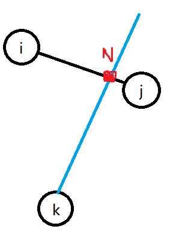

## 序言
>这次比赛只拿了 $10$ 分，为什么呢？第三题打爆搜，原本可以拿 $30$ 分，但是没打`freopen`爆 $0$ 了。第二题输出循序错了，也爆 $0$ ，只有第四题骗了 $10$ 分。

## 作业调度方案
这是一道模拟，虽然是模拟，但是由于题目描述过于~~模糊（语文不好）~~，所以没有读懂题目。
### 题意
给你一个 $m$ , $n$ 分别表示：机器数与工件数。   
前 $n$ 行依次表示每个工件的每个工序所使用的机器号，第 $1$ 个数为第 $1$ 个工序的机器号，第 $2$ 个数为第 $2$ 个工序机器号，等等。   
最后让你求最小的加工时间。
### 解法
```cpp
#include <bits/stdc++.h>
using namespace std;
int m, n;
int gx[30]/*工序数*/ , last[30]/*第 i 个工件制成的时间*/; 
int a[42000], ans;
bool mt[25][10050]; // 第 i 个机器时间的是否占用
struct GG
{
    int num/*工件的工序*/, time/*需要的时间*/;
} s[220][220];
int main()
{
#ifdef ONLINE_JUDGE
    freopen("jsp.in", "r", stdin);
    freopen("jsp.out", "w", stdout);
#endif
    cin >> m >> n;
    for (int i = 1; i <= m * n; i++)
        cin >> a[i];
    for (int i = 1; i <= n; i++)
        for (int j = 1; j <= m; j++)
            cin >> s[i][j].num;
    for (int i = 1; i <= n; i++)
        for (int j = 1; j <= m; j++)
            cin >> s[i][j].time;
    for (int i = 1; i <= n * m; i++)
    {
        int z = 0, j = last[a[i]] + 1;
        gx[a[i]]++;//下一个工序
        int x = s[a[i]][gx[a[i]]].num;
        int v = s[a[i]][gx[a[i]]].time;
        while (z != j)
        {
            if (!mt[x][j]) z++;//空挡的长度
            else z = 0;
            j++;
        }
        for (int k = j - v + 1; k <= j; k++)
            mt[x][k] = 1;
        last[a[i]] = j;
        ans = max(ans, last[a[i]]);
    }
    cout << ans;
    return 0;
}
```

## 火柴棒等式
考场时并没有想到枚举数字的范围，发现时间复杂度非常高：$\mathcal {O(10000^4)}$ ，于是打表，但是打表时认为 $n < 13$ 时答案为 $0$ ，再加上一些奇奇怪怪的 $\textrm {BUG}$ ，就爆 $0$ 了。事实上，我们的$a$ ，$b$ , $c$ 只需要枚举到 $1000$ 即可，最后使用函数计算出 $a$ ，$b$ ，$c$ 使用的火柴数量是否符合题意即可。   
过于简单，就不贴代码了。
## 	传纸条
### 题意
给出一个 $n \times m$ 矩阵，要求从 $(1,1)$ 走到 $(n,m)$ 中经过的数值最大，再从 $(n,m)$ 走到 $(1,1)$ ，也是求数值最大的走法，但是走过的路不能重复。   
### 解法
考场一眼就可以看出来是 $\textrm {DP}$ ,但是有一个比较难处理的地方：走过的路不能重复走。    
题目中的从 $(1,1)$ 走到 $(n,m)$ ， 再从 $(n,m)$ 走到 $(1,1)$，我们就可以看作从 $(1,1)$ 走到 $(n,m)$ 走两遍。    
于是设定状态：$\large f_{i,j,k,l}$ 表示第一个纸条走到了 $(i,j)$ ，第二个纸条走到了 $(k,l)$。   
转移方程：
$$
\large{
f_{i,j,k,l} = \max_{i=1}^n(\max_{j=1}^n(\max_{k=1}^n(\max_{l=1}^n(f_{i-1,j,k-1,l} , f_{i,j-1,k-1,l} , f_{i-1,j,k,l-1} , f_{i,j-1,k,l-1})))
}
$$

## 树网的核
很简单，跑一遍`Floyd`,再用一些奇妙的公式即可：
```cpp
#include <bits/stdc++.h>
using namespace std;
int n, s, ans = INT_MAX;
int g[700][700];
void floyd()
{
    for (int i = 1; i <= n; i++)
        for (int j = 1; j <= n; j++)
            for (int k = 1; k <= n; k++)
                if (i != j && j != k && i != k)
                    g[i][j] = min(g[i][j], g[i][k] + g[k][j]), g[j][i] = g[i][j];
}
int main()
{
#ifdef ONLINE_JUDGE
    freopen("core.in", "r", stdin);
    freopen("core.out", "w", stdout);
#endif
    cin >> n >> s;
    memset(g, 0x3f, sizeof(g));
    for (int i = 1; i <= n; i++)
        g[i][i] = 0;
    for (int i = 1; i <= n; i++)
    {
        int x, y, z;
        cin >> x >> y >> z;
        g[x][y] = g[y][x] = z;
    }
    floyd();
    for (int i = 1; i <= n; i++)
        for (int j = 1; j <= n; j++)
            if (g[i][j] <= s)
            {
                int p = INT_MIN;
                for (int k = 1; k <= n; k++)
                    p = max(p, (g[i][k] + g[j][k] - g[i][j]) / 2);
                ans = min(ans, p);
            }
    cout << ans;
    return 0;
}
```
你问我公式怎么来？好比这个图    

$$\large{ik+jk=in+kn+jn+kn}$$
$$\large{ij+2kw=ik+jk}$$
$$\large{kw=(ik+jk-ij) \div 2}$$