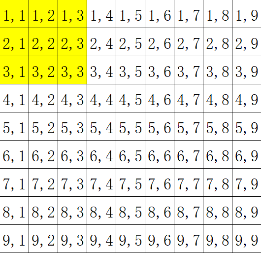

# 2024.7.12总结
[比赛传送门](https://gmoj.net/junior/#contest/problems/1999)
## 潜伏者
纯水题，看懂题目都做得对。
## Hankson 的趣味题
暴力做法：枚举 $x$ 到 $b_1$ ，按题目计算即可，期望得分: $50$ 分。
已知：$b_1≤2,000,000,000$ , $n≤2000$ ，于是暴力的时间复杂度是 $\mathcal {O(2,000,000,000 ^ {2000})}$。  
于是我们枚举到 $\sqrt{b_i}$ ，因为两个数议定书两个数的最小公倍数的因子，于是我们将 $b_i \div x$  和 $x \div b_i$ 分开计算。   
<font color=red>注意：</font>计算的前提条件是 $b_i \mod x = 0$ 的，且如果 $b_i \div x = x \div b_i$时，只能计算一次。
## 最优贸易
此题奆说要使用 $\textrm {tarjan}$ ，但是其实可以使用 $\textrm {SPFA}$ 进行解题。  
我们分别跑两次 $\textrm {SPFA}$ 分别是从前往后，从后往前，注意，如果是从后往前，就需要反向建边，最后正常 $\textrm {SPFA}$ 即可。    
松弛部分（SPFA2相反即可）：
```cpp
    int v = g1[i].to;
    if (dis1[v] > min(dis1[u], a[v]))
    {
        dis1[v] = min(dis1[u], a[v]);//我们设dis1为MAX值
        if (!bz[v])
        {
            q.push(v);
            bz[v] = 1;
        }
    }
```
$$
答案=\max_{i=1}^n(dis2_i-dis1_j)
$$
## 靶形数独
没有所谓正解，暴搜期望得分：$80$ ，模拟赛时因为一些奇奇怪怪的 $\textrm {BUG}$ 没有拿到 $80$ 分。   
$100$ 分也只是在 $80$ 分的基础上优化而已：我们优先选择每行 $0$ 少的点，因为数独的特性，$0$ 少也就意味着可选择的数字少，递归层数也少，自然就可以过了。

处理小方块有点难想，但是画个图即可理解：
   
我们可以把 $3 \times 3$ 的格子压成 $1 \times 1$ 的格子，就像这样：
```cpp
    long long xx, yy;
    if (x % 3 == 0)
        xx = x / 3;
    else
        xx = x / 3 + 1;
    if (y % 3 == 0)
        yy = y / 3;
    else
        yy = y / 3 + 1;
```