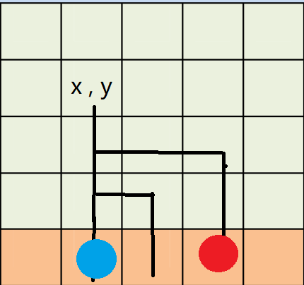

## 【NOIP2010tj】机器翻译
纯水题，**模拟队列**就过了。
## 乌龟棋
比赛时动态规划没有打出来，暴搜拿了 $20$ 分，实际上十分简单： 

观察题目可得：每种类型的卡片上只有$1$ 、$2$ 、$3$ 、$4$ 四个数字之一  

于是可以得出状态： 
$$
f_{i_1,i_2,i_3,i_4}表示数值为1的的卡牌用了i_1次，数值2的卡牌用了i_2次，以此类推\dots
$$
那么我们很轻松就可以得出转移方程（$a$表示输入的第二行）：
$$
f_{i_1,i_2,i_3,i_4}=\max(f_{i_1,i_2,i_3,i_4},f_{i_1-1,i_2,i_3,i_4}+a_{(1 + i_1 + i_2 \times 2 + i_3  \times 3 + i_4  \times 4)})    
$$
剩下的可以以此类推：
```cpp
 f[0][0][0][0] = a[1];//初值
    for (int a1 = 0; a1 <= _[1]; a1++)
        for (int a2 = 0; a2 <= _[2]; a2++)
            for (int a3 = 0; a3 <= _[3]; a3++)
                for (int a4 = 0; a4 <= _[4]; a4++) {
                    if (a1 > 0) f[a1][a2][a3][a4] = max(f[a1 - 1][a2][a3][a4] + a[1 + a1 + a2 * 2 + a3 * 3 + a4 * 4], f[a1][a2][a3][a4]);
                    if (a2 > 0) f[a1][a2][a3][a4] = max(f[a1][a2 - 1][a3][a4] + a[1 + a1 + a2 * 2 + a3 * 3 + a4 * 4], f[a1][a2][a3][a4]);
                    if (a3 > 0) f[a1][a2][a3][a4] = max(f[a1][a2][a3 - 1][a4] + a[1 + a1 + a2 * 2 + a3 * 3 + a4 * 4], f[a1][a2][a3][a4]);
                    if (a4 > 0) f[a1][a2][a3][a4] = max(f[a1][a2][a3][a4 - 1] + a[1 + a1 + a2 * 2 + a3 * 3 + a4 * 4], f[a1][a2][a3][a4]);
                }
```
## 引水入城
这是一道搜索题，实现不难，但是比较难想。
### 第一步
我们先对第一行的每一个点进行 DFS ,把走过的点进行标记，看最后一行是否全都被标记，如果没有，输出 $0$ 。
### 第二步
接下来我们要在 DFS 中进行 $r$ 数组和 $l$ 数组的维护：

$r_{x,y}$表示的是以坐标为 $x,y$ 的点出发，可以到达的最右侧的点  
$l_{x,y}$表示的是以坐标为 $x,y$ 的点出发，可以到达的最坐侧的点

  
例如在这个图中: $l_{x,y}=2$ 就是蓝色那个点，$r_{x,y}=4$ 就是红色那个点。
这个 DFS 过程中求即可
### 跳数
```cpp
int k = 1;//当前跳到的点
while (k <= m) {//保证在 m 内
    int cmp = 0;//临时变量
    ans++;
    for (int i = 1; i <= m; i++)
        if(l[1][i]<=k)//在l的右边，表示在l和r的区间内
            cmp = max(cmp, r[1][i]);//找到最大的右端点
    k = cmp + 1;//跳
}
```
## 关押罪犯
这是一道**并查集**，我们将人分为两类，一类是互相是仇人，一类是互相是 “友人” ，我们通过并查集进行维护：     

先将输入的数组的权值进行从大到小的排序，然后开始维护：
```cpp
for (int i = 1; i <= m; i++) {
    int fx = find(g[i].a);
    int fy = find(g[i].b);
    if (fx == fy) {//如果两人的仇人是同一个人，俗话说：敌人的敌人是朋友，我们便将权值输出
        cout << g[i].c;
        return 0;
    }
    if (fx != fy) {
        f[fx] = find(g[i].b + n);//将他们划分为仇人，n就表示仇人的那一类
        f[fy] = find(g[i].a + n);
    }
}
cout << 0;//处理没有冲突的情况
```