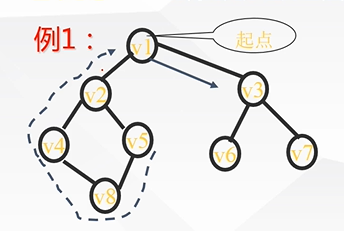

# 图
图：记为：`G=(V,E)`  
其中：$V$ 是顶点集合，是有穷非空集，$E$ 是边集合，是有穷集。

问：当 `E(G)` 为空时，图 $G$ 存在否？  
答：存在！但此时图 $G$ 只有顶点，没有边。

无向图：每条边是无方向的。  
有向图：每条边是有方向的。  
完全图：任意两条边有一条边相连接。 

* 若 $n$ 个接点的无向图有 $ n(n-1)\div 2$ 条边，称为无向完全图。
* 若 $n$ 个接点的有向图有 $ n(n-1)$ 条边，称为有向完全图。

## 图的基本术语
### 连通图
连通图：在**无向图**中，<u>若任何两个顶点都存在路径可达</u>，则此图为**连通图**。    
非连通中找到的极大连通子图叫
做：**连通分量**。

强连通图：在**有向图**中，<u>若任何两个顶点都存在路径可达</u>，则此图为**强连通图**。  
非强连通图中找到极大的强连通子图叫做：**强连通分量**。

**注意**：**自身带环的图**和**多重图**不在讨论范围内！

### 路径与回路
**路径**：从点 $A$ 到点 $B$ 的经过的所有的边。  
**回路**：起点和终点相同的路径

**简单路径**：在一条路径内，除起点和终点以外。其余各点各不相同。  
**简单回路**：由简单路径构成的回路称为**简单回路**。

#### 路径的长度：
非带权图上路径的长度指路径上的**边的跳数**。  
带权图上路径的长度指路径上的**各边的权之和**。

### 顶点的度、入度和出度

顶点 $V$ 的度 $=$ 与 $V$ 相关联的边的数目

#### 在有向图中:
顶点 $V$ 的出度 $=$ 以 $V$ 为起点有向边数    
顶点 $V$ 的入度 $=$ 以 $V$ 为终点有向边数
顶点 $V$ 的度 $= V$  的出度 $+V$ 的入度  
图的度 $=$ 图中所有顶点度的和
$>$ 设图 $G$ 的顶点数为 $n$ ，边数为 $e$。  
图的所有顶点的度数之和 $2e$。  
(每条边对图的所有顶点的度数和 "贡献" $2$ 度)

## 图的遍历
### DFS遍历
左边优先，不可以走走过的路；

例如：

DFS遍历结果：$v1 \rightarrow v2 \rightarrow v4 \rightarrow v8
\rightarrow v5 \rightarrow v3
\rightarrow v6 
\rightarrow v7$。

### BFS遍历
每次输出一层。

